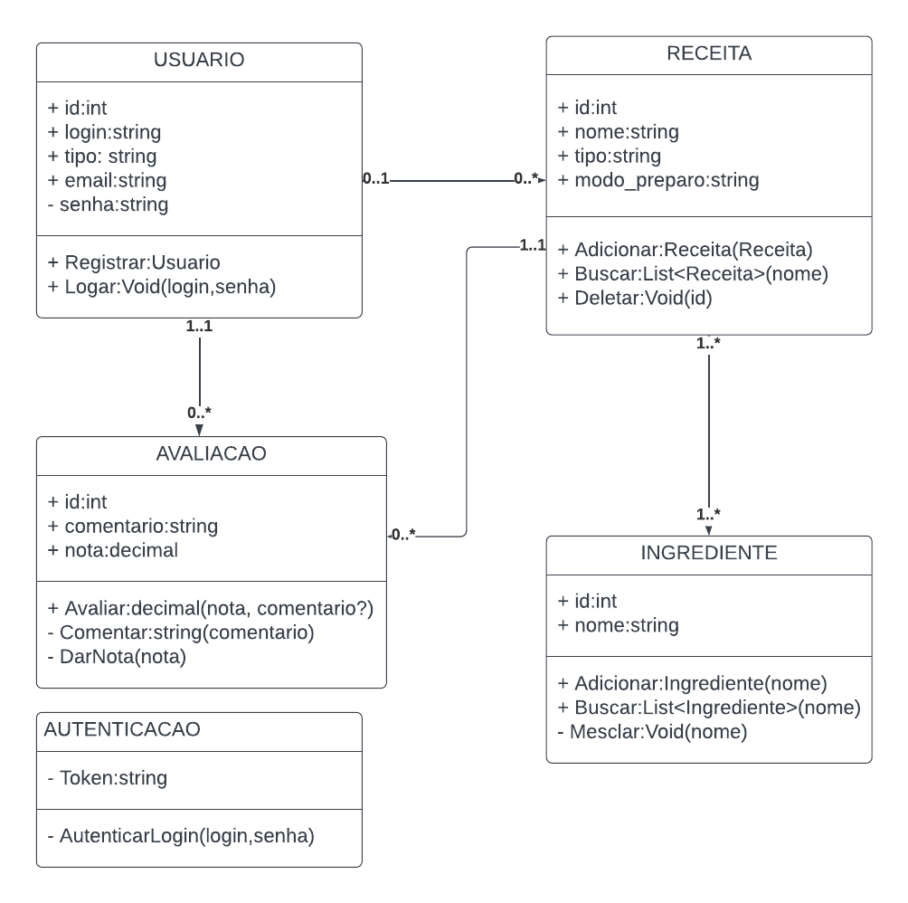
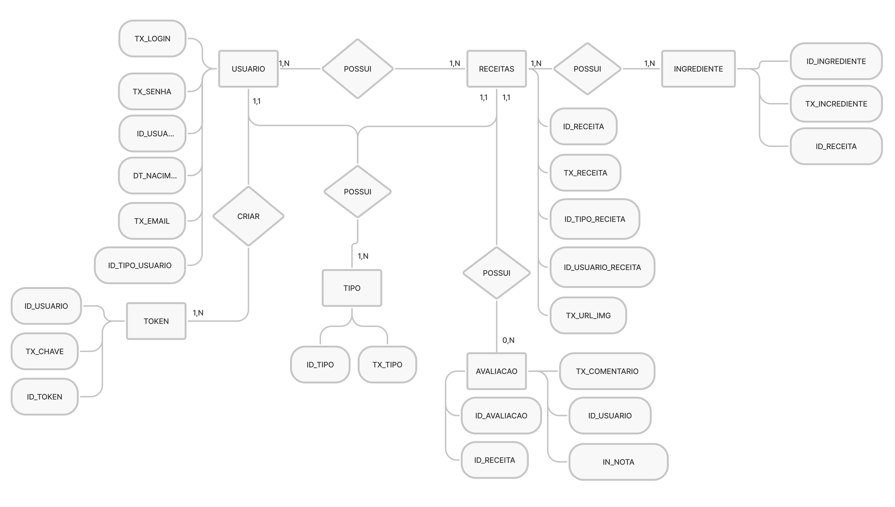
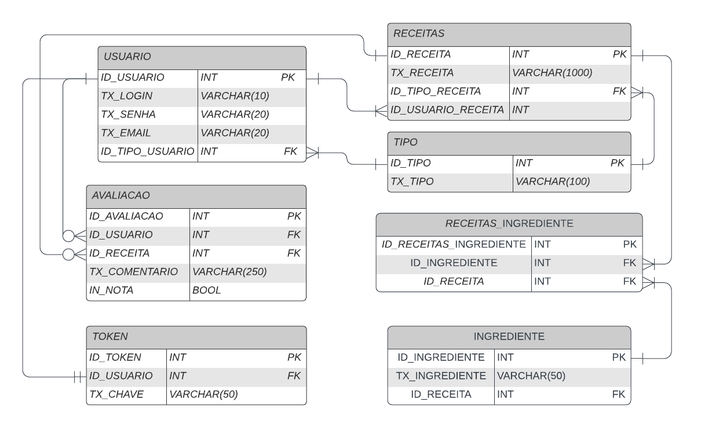

# Arquitetura da Solução

Definição de como o software é estruturado em termos dos componentes que fazem parte da solução e do ambiente de hospedagem da aplicação.

## Diagrama de Classes

O diagrama abaixo ilustra a relação entre classes e suas funcionalidades dentro do sistema.

## Modelo ER

O relacionamento entre entidades e suas propriedades estão descritas abaixo.

## Esquema Relacional

As tabelas que estruturam o sistema, bem como suas ligações, restrições de integridade e chaves estão descritas abaixo.

<!--
## Modelo Físico

Entregar um arquivo banco.sql contendo os scripts de criação das tabelas do banco de dados. Este arquivo deverá ser incluído dentro da pasta src\bd.
-->

## Tecnologias Utilizadas

Tecnologias utilizadas para desenvolvimento do Aplicativo 100 Ingredientes:

- Linguagens utilizadas:
    - JavaScript
    - JSON
    - MarkDown
- Ferramentas para codificação e emulação:
    - Expo 
    - Visual Studio Code 
    - BlueStacks
- Bibliotecas:
    - React-native
    - React
    - SQLite
    

## Hospedagem

Hospedaremos nos Back-end no 
 [ Heroku](http://pythonclub.com.br/publicando-seu-hello-world-no-heroku.html), nosso APK será publicado na Play Store com um custo de $25 dolares, taxa cobrado uma unica vez pela plataforma. 

## Qualidade de Software

 A norma internacional ISO/IEC 25010 define oito características e 30 subcaracterísticas sobre qualidade para produtos de software. Embora todas estas sejam relevantes e desejáveis, este projeto tem foco em medir a qualidade segundo estes aspectos:

- Adequação Funcional
    - Completude funcional
    - Correção funcional
- Eficiência/Performance
    - Utilização de recursos
- Usabilidade
    - Operabilidade
    - Proteção contra erro do usuário
    - Estética de interface
- Confiabilidade
    - Maturidade
    - Tolerância a falhas
- Segurança
    - Confidencialidade
    - Integridade
- Manutenibilidade
    - Modularidade
    - Reusabilidade
    - Modificabilidade
- Portabilidade
    - Adaptabilidade