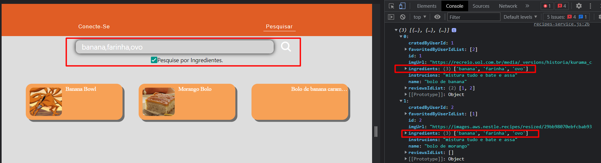
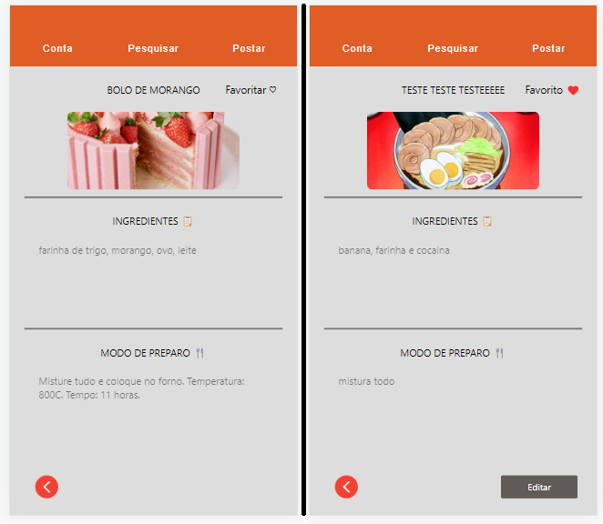
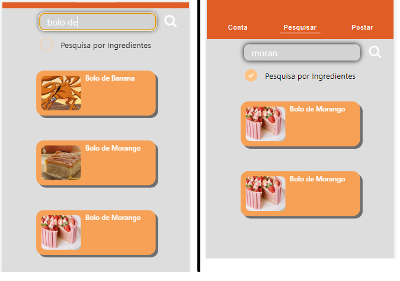
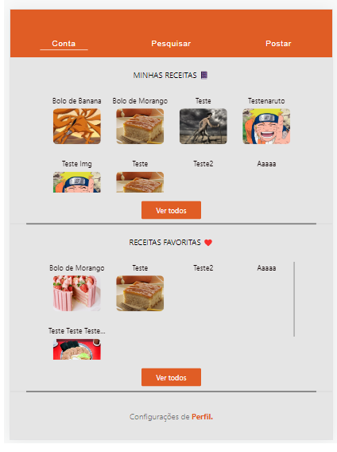

# Registro de Testes de Software

Relatório com as evidências dos testes de software realizados no sistema pela equipe, baseado em um plano de testes pré-definido.

|Caso de Teste | CT-01 - Funcionamento do Usuário|
|:--|:--|
|**Objetivo do teste**|Verificar e testar a aparição das receitas e filtro pelos ingredientes selecionados.|
|**Resultado**|A aplicação exibe as ultimas receitas adicionadas com sucesso. A aplicação exibe as receitas com base no filtro dos ingredientes selecionados pelo usuário com sucesso.|

|Caso de Teste | CT-02 - Funcionamento das Mais Informações das Receitas|
|:--|:--|
|**Objetivo do teste**|Verificar se as informações detalhadas da receita irá ser exibida, deverá exibir as informações de preparo e os ingredientes necessários, deverá exibir a imagem final de preparo.|
|**Resultado**|O usuário consegue acessar as informações detalhas das receitas com sucesso, a aplicação está exibindo os ingredientes, as informações de preparo e a imagem final com sucesso.|

|Caso de Teste | CT-03 - Verificação do filtro|
|:--|:--|
|**Objetivo do teste**|Filtrar as receitas pelos ingredientes escolhidos por cliente, caso não tenha as receitas a aplicação deverá informar para o usuário.|
|**Resultado**|A aplicação está filtrando com sucesso as receitas com base nos ingredientes escolhidos por cliente com sucesso. A aplicação está retornando a mensagem corretamente caso não seja encontrado receitas com os ingredientes escolhidos.|

|Caso de Teste | CT-04 - Adicionar comentário na receita caso logado e Poder favoritar|
|:--|:--|
|**Objetivo do teste**|Adicionar um comentário e favoritar as receitas, podendo realizar apenas se o usuário estiver logado na aplicação, o comentário será exibido para todos que utilizarem a aplicação independente do status de login.|
|**Resultado**|A aplicação esta favoritando e listando para o usuario na aba Conta.|

## Avaliação

As funcionalidades foram bem executas e com ótimo funcionamento conforme programado e planejado.