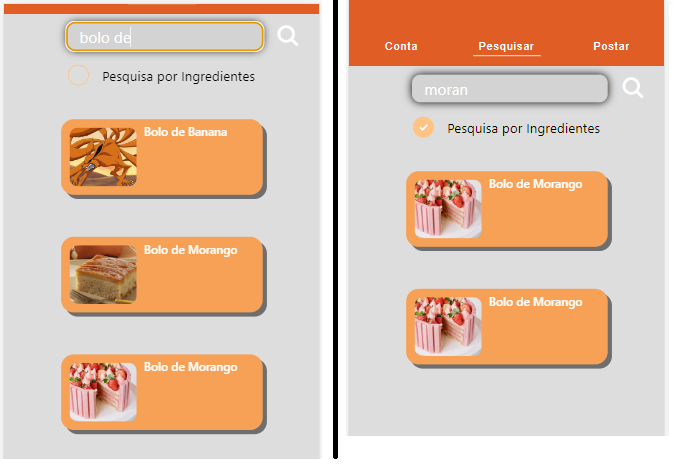

# Registro de Testes de Usabilidade

Relatório com as evidências dos testes de software realizados no sistema pela equipe, baseado em um plano de testes pré-definido.

|Caso de Teste | CT-01 - Responsividade|
|:--|:--|
|**Objetivo do teste**| O usuario deverá acessar a aplicação em todos as resoluções de display.|
|**Resultado**|O conteúdo da aplicação está responsiva podendo ser acessado em todas as resoluções de display de forma legível e se adequando para a resolução necessária.|

|Caso de Teste | CT-02 - Verificar Otimização da Aplicação|
|:--|:--|
|**Objetivo do teste**|Verificar o desempenho da aplicação nos sistemas operacionais mobiles diversos.|
|**Resultado**|O usuário consegue acessar a aplicação indenpendete do Sistema Operacional mobile utilizado.|

|Caso de Teste | CT-03 - Acesso incial da Aplicação|
|:--|:--|
|**Objetivo do teste**|Verificar o acesso e a inicialização da aplicação atraves do Login.|
|**Resultado**|O usuário consegue acessar e realizar o Login com sucesso tendo o retorno da aplicação de forma rápida e constante, também podendo continuar logado caso deseje.|

|Caso de Teste | CT-04 - Carregamento das receitas de forma vertical.|
|:--|:--|
|**Objetivo do teste**|O usuário deverá conseguir buscar as receitas de forma vertical e otimizada.|
|**Resultado**|O usuário consegue buscar as receitas de forma vertical e otimizada com sucesso e desempenho favorável. Sendo possível realizar a busca pelo Nome das Receitas e pelos Ingredientes contidos nas Receitas com sucesso.|

|Caso de Teste | CT-05 - Detalhamento das Receitas|
|:--|:--|
|**Objetivo do teste**|O usuário deverá poder acessar os detalhes da receita escolhida.|
|**Resultado**|Usuário é direcionado com sucesso para mais detalhes da receita escolhida, contendo suas infomrações de forma mais detalhada.|

|Caso de Teste | CT-06 - Contatar os desensenvolvedores|
|:--|:--|
|**Objetivo do teste**|O usuário deverá poder se comunicar com os desenvolvedores através de formulário de email ou de suas redes sociais profissionais.|
|**Resultado**|Usuário consegue realizar o contato com os desenvolvedores com sucesso através de suas redes sociais e Email.|

## Avaliação

Todas funcionabilidades estão corretas de acordo com a documentação.